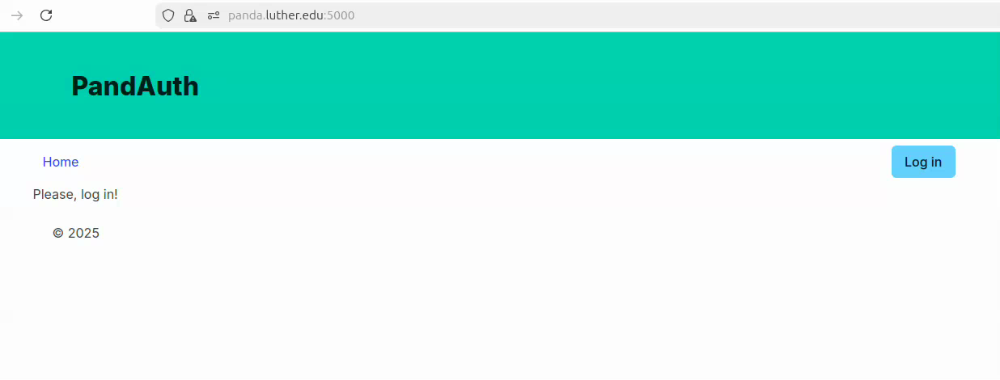

# Use OAuth for user Authorization

The purpose of this project is for you to work with various tools (`openssl`, `flask` etc) to enable access to your web application over HTTPS and user authorization using OAuth.
Follow the tutorials and make the necessary changes to your application as you copy/paste commands and code snippets.

## Seize domain name

You must control a domain name for the certificate (and the OAuth) to make sense and work properly.
The easiest way to commandeer a domain is to edit `/etc/hosts` file on Ubuntu or `c:\Windows\System32\drivers\etc\` on Windows.
Adding the following line to that file will redirect any requests for *panda.luther.edu* to *127.0.3.3* (localhost).

Use your own name and address (anything in the 127/8 subnet is a `localhost`, I chose 0.3.3 because it's 330 backwards).

```bash
127.0.3.3 panda.luther.edu
```

## Generate the TLS certificate

Follow Step 2 of the [DigitalOcean tutorial](https://www.digitalocean.com/community/tutorials/how-to-create-a-self-signed-ssl-certificate-for-apache-in-ubuntu-20-04) and create a self-signed certificate.
The resulting certificate must be a file *exercises/authorization/panda/ssl/certs/selfsigned330.crt* with the corresponding key *exercises/authorization/panda/ssl/private/selfsigned330.key*.
Your certificate should be similar to *norse-panda* and contain the following data:

- Country Name: **US**
- State name: **Iowa**
- Locality Name: **Decorah**
- Organization Name: **CS330**
- Organizational Unit Name: **2025FA**
- Common Name: **your first name**
- Email Address: optional

Both DigitalOcean and Grinberg use basically the same command:

```bash
openssl req -new -x509 -days 365 -key keyfile -out certfile
```

The default key size is 2048 bits and it should be enough for the purposes of this exercise.

### See the certificate contents

This command shows the certificate issuer and the output must contain the information you entered earlier.

```bash
$ openssl x509 --noout -text -in panda/ssl/certs/selfsigned330.crt | grep Issuer
Issuer: C = US, ST = Iowa, L = Decorah, O = CS330, OU = 2025FA, CN = Norse Panda, emailAddress = panda@example.com
$ openssl x509 --noout -text -in panda/ssl/certs/selfsigned330.crt | grep Issuer | cut -d , -f 6
CN = Norse Panda
```


## Run Flask over HTTPS

Read [Miguel Grinberg's tutorial](https://blog.miguelgrinberg.com/post/running-your-flask-application-over-https) and add the generated key and certificate to your Flask app for it to be accessible over HTTPS.
Note that the structure of your application is going to differ from the one described in the tutorial.

You should be able to visit the following URL in your browser: <https://panda.luther.edu:5000>.

The majority of configuration is provided in the *.flaskenv*:

```text
FLASK_APP="panda"
FLASK_RUN_HOST="panda.luther.edu"
FLASK_RUN_CERT="panda/ssl/certs/selfsigned330.crt"
FLASK_RUN_KEY="panda/ssl/private/selfsigned330.key"
```

## Enable and use OAuth

Follow the [RealPython tutorial](https://realpython.com/flask-google-login/) to enable OAuth and get access to basic user information.
Note that the structure of your application is going to differ from the one described in the tutorial.

The result should look as follows:



Notice that you will see a couple of additional screens before the user information is displayed.

## (Optional) Get a Real TLS Certificate

Follow the [tutorial](https://letsencrypt.org/getting-started/) from Let's Encrypt and the tool they recommend, `Certbot`, to generate a certificate signed by a proper Certificate Authority.

Using Let's Encrypt is optional but highly recommended.

## Testing

Some unit tests are provided.
Run them as follows:

```bash
python -m pytest tests/authorization
```

## Deliverables

- Certificate
- Application code
- Recording (gif, apng, or mp4) of the login process

It is not a good practice to keep secrets in your repository, so you must add Flask secret (`SECRET_KEY`) and your Google credentials (`GOOGLE_CLIENT_ID` and `GOOGLE_CLIENT_SECRET`) to the *.env* instead, and **not** commit this file.
I should be able to run your application up to a certain point and rely on the existence of the certificate, passed tests, and the recording to verify your application.

## References

- [How To Create a Self-Signed SSL Cert for Apache in Ubuntu 20.04 | DigitalOcean](https://www.digitalocean.com/community/tutorials/how-to-create-a-self-signed-ssl-certificate-for-apache-in-ubuntu-20-04)
- [Running Your Flask Application Over HTTPS - miguelgrinberg.com](https://blog.miguelgrinberg.com/post/running-your-flask-application-over-https)
- [Create a Flask Application With Google Login – Real Python](https://realpython.com/flask-google-login/)
- [Getting Started - Let's Encrypt - Free SSL/TLS Certificates](https://letsencrypt.org/getting-started/)
- [Creating Self-Signed SSL Certificates for Apache on Linux - Linux.com](https://www.linux.com/training-tutorials/creating-self-signed-ssl-certificates-apache-linux/)
- [Login to your Flask app with Google - Python Tutorial](https://pythonspot.com/login-to-flask-app-with-google/)
- [Command Line Interface — Flask Documentation (3.1.x)](https://flask.palletsprojects.com/en/stable/cli/#environment-variables-from-dotenv)
- [Certbot](https://certbot.eff.org/)
- [badssl.com](https://badssl.com/)
