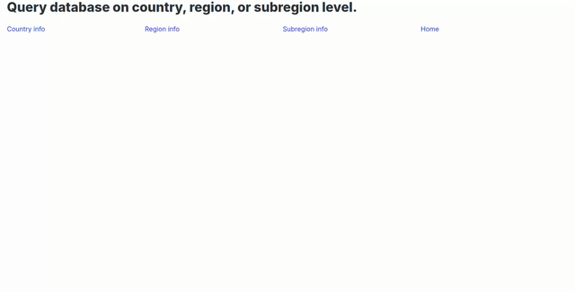

# Geography

Connect to the **world** database on *knuth.luther.edu* or its SQLite3 version and retrieve the following information about a *country*, a *region*, or a *continent* by visiting */country*, */region*, or */continent* respectively:

1. Country name
2. Continent
3. Region
4. Capital name
5. Surface area
6. Population
7. Form of government
8. Head of state

## Demo

## Requirements

1. Use *POST* method to submit selection to the server.
2. Use *records* to connect to the database.
3. Use the provided local *Bootstrap*, *Bulma*, or *MUI* to format the results.
4. (Optional) Deploy this app on *pythonanywhere.com*
