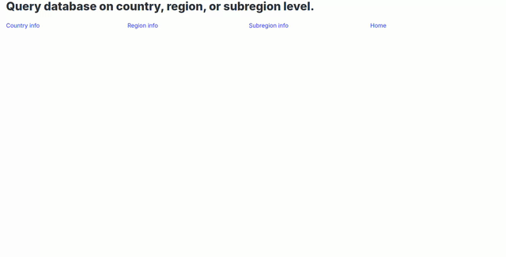

# Geography

Connect to the _world_ database on _knuth.luther.edu_ or its SQLite3 version and retrieve the following information about a _country_, a _region_, or a _continent_ by visiting _/country_, _/region_, or _/continent_ respectively:

1. Country name
2. Continent
3. Region
4. Capital name
5. Surface area
6. Population
7. Form of government
8. Head of state

## Demo

## Requirements

1. Use `POST` method to submit selection to the server.
2. Use `psycopg`, or `sqlite3` to connect to the database.
3. Use the provided local _Bootstrap_, _Bulma_, or _MUI_ to format the results.
