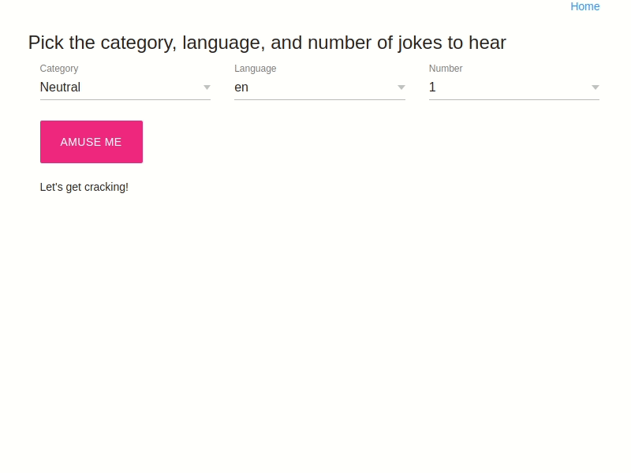

# Using Flask for Fun

## Description

Use Flask and [pyjokes](https://github.com/pyjokes/pyjokes) to build a web application that would allow users to select category of jokes (neutral or Chuck Norris) and print 1 (one) joke from the selected category.

```python
>>> import pyjokes
>>> pyjokes.get_jokes()
>>> pyjokes.get_jokes(category='neutral', language='de')
```

## Notes

1. You CAN NOT use JavaScript in this exercise.
   1. Populate drop-downs using Jinja2 templates.
2. Do not hard-code jokes.
   1. Call `pyjokes`

Add one of the following features to the initial application:

1. Use some HTML/CSS framework to style the app
2. Allow users to select the joke language


