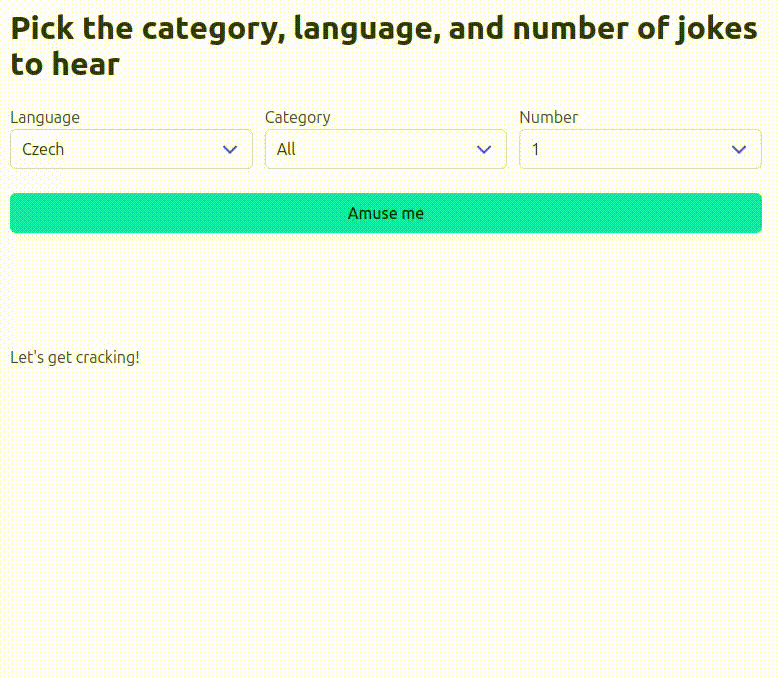

# Using Flask for Fun

## Description

Use Flask and [pyjokes](https://github.com/pyjokes/pyjokes) to build a web application that would allow users to select language and category of a joke and use Jinja2 to print 1 (one) joke from the selected category.

```python
>>> import pyjokes
>>> pyjokes.get_joke()
>>> pyjokes.get_jokes()
>>> pyjokes.get_jokes(language="de", category="neutral")
```

## Requirements

1. Use some HTML/CSS framework to style the app
2. Allow users to select the joke language (*en*, *es*, or *de*)
3. Allow users to select the joke category (*neutral* or *Chuck Norris*)
4. Populate drop-downs using Jinja2 templates
   1. Do not use JavaScript in this exercise
5. Call `pyjokes` with the specified category and language to retrieve a *random* joke
6. Handle the error (no jokes about Chuck Norris in Spanish)
7. (Optional) Allow users to select number of jokes (remove `@pytest.mark.skip` from the test file to test this functionality)

## Testing

Use the provided tests (*tests/jokes*) to verify the correctness of implementation.

```bash
python3 -m pytest -v tests/jokes/test_jokes.py
python3 -m pytest -v tests/jokes/test_jokes_front.py
```

## Demo

Note that the 3rd `select` element (number of jokes) is *optional*.

I used [MUI](https://www.muicss.com/) but you may continue using [Bootstrap](https://getbootstrap.com/).


