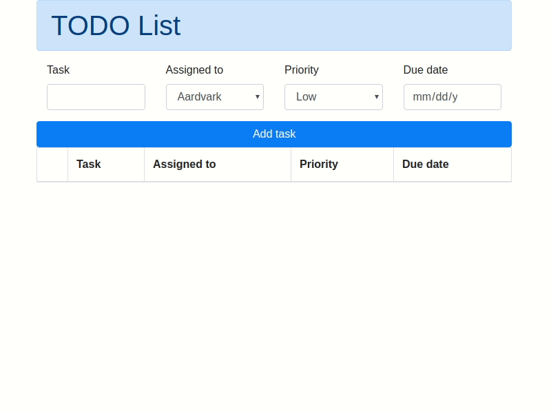

# List design

Implement the following TODO List functionality using HTML, CSS, and JavaScript. Use of Bootstrap is encouraged.

## Design

## Functionality

| Element | Type | Comment |
|---|---|---|
| Title | input text | required |
| Assigned to | drop-down | pre-populated in JS |
| Priority | drop-down | pre-populated, determines color of a row |
| Due date | date picker | required |
| Add task | button | validates the form and adds a new row |
| Checkbox | checkbox | removes a row from the table |

## References

- [Bootstrap form validation - examples & tutorial. Basic & advanced usage - Material Design for Bootstrap](https://mdbootstrap.com/docs/jquery/forms/validation/)
- [Form data validation - Learn web development | MDN](https://developer.mozilla.org/en-US/docs/Learn/HTML/Forms/Form_validation)
- [How to use JavaScript closures with confidence – Hacker Noon](https://hackernoon.com/how-to-use-javascript-closures-with-confidence-85cd1f841a6b)
