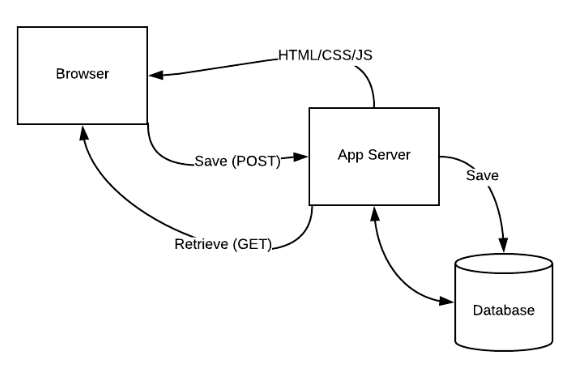

# Modern Web Development



## Key components

### Templates

- Easier than `print`.
- HTML with placeholders

### Databases

- Permanent, server-side storage.
- Object Relational Mapping

### Forms

- Built-in validation
- Built-in storing to the DB

### Flask

- Micro web framework
- Uses Python
- Werkzeug
- Jinja

### Flask references

- [Quickstart — Flask 1.0.2 documentation](http://flask.pocoo.org/docs/1.0/quickstart/)
- [Flask by Example – Project Setup – Real Python](https://realpython.com/flask-by-example-part-1-project-setup/)
- [Make a Web App Using Python & Flask! — Creating a Python Website from the Bottom Up » Arya Boudaie's Personal Site](https://aryaboudaie.com/python/technical/educational/web/flask/2018/10/17/flask.html)
- [The Flask Mega-Tutorial Part I: Hello, World! - miguelgrinberg.com](https://blog.miguelgrinberg.com/post/the-flask-mega-tutorial-part-i-hello-world)
- [Python Flask Tutorial: Full-Featured Web App Part 1 - Getting Started - YouTube](https://www.youtube.com/watch?v=MwZwr5Tvyxo)
- [Creating Web APIs with Python and Flask | Programming Historian](https://programminghistorian.org/en/lessons/creating-apis-with-python-and-flask)
- [Python and Flask Tutorial in Visual Studio Code](https://code.visualstudio.com/docs/python/tutorial-flask)

## Simple Flask app

### Code (_flask_basics.py_)

```python
from flask import Flask
app = Flask(__name__)

@app.route('/')
def hello_world():
    return 'Hello, World!'

@app.route('/user/<name>')
def hello_user(name):
   return 'Hello <strong>{}</strong>'.format(name)

```

### Start the app

```bash
export FLASK_APP=flask_basics.py
flask run
```

### Debug mode

- Auto-restart the server on code change
- Debugging on errors

### Enable debug mode

```bash
export FLASK_ENV=development
flask run
```

Put the configuration variables into a file **.flaskenv** that you can later reuse.

```bash
export FLASK_APP=app.py
export FLASK_ENV=development
```

### Run flask app on a server

Remember to **disable debug mode** before deployment!

```bash
flask run --host=0.0.0.0
```

## Flask routing

```python
@app.route('/path/<path:subpath>')
def show_subpath(subpath):
   return '{}'.format(subpath)
```

- Function is triggered as a response to the URL specified in the _decorator_

- The return type must be a string, tuple, Response instance, or WSGI callable (iterable)

- _converter_ in the `<converter:variable_name>` is optional

| type   | comment                       |
| ------ | ----------------------------- |
| string | default                       |
| int    | positive integers             |
| float  | positive floating point       |
| path   | string with slashes           |
| uuid   | UUID strings (128-bit number) |

Trailing slash is important!

## Testing

```bash
python -m pytest -v tests/flask_basics/test_flask_basics.py
```

### Testing references

- [Testing Flask Applications — Flask Documentation (1.1.x)](https://flask.palletsprojects.com/en/1.1.x/testing/)
- [Testing Flask Applications with Pytest | TestDriven.io](https://testdriven.io/blog/flask-pytest/)

## Processing input forms

```python
from flask import request
```

All values from a form are assembled in `request.args`

## Deployment

### pythonanywhere

```bash
git clone git@bitbucket.org:yasinovskyy/ip-class-prep.git
```
