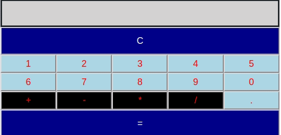

# Calculator

Implement a simple calculator that performs the following operations: addition, subtraction, multiplication, and division.

## HTML elements

* The "screen": an empty *div* to display an expression and the result
* Button container(s)
* Buttons
  * 10 digits (1, 2, 3, 4, 5, 6, 7, 8, 9, 0)
  * A decimal point (.)
  * 4 operations (+, -, *, /)
  * Clear screen (C)
  * Evaluate (=)

## Styling

Use of Bootstrap is optional but highly encouraged. Bootstrap CSS and JavaScript files are provided.

## Functionality

Operations are performed on floating-point numbers and the results may be presented in scientific notation. Let JavaScript handle the math.

## Acceptable limitations

Use positive numbers in the expression. The result may be negative though.

## Submitting the assignment

Complete files *calculator.html*, *calculator.js*, and *calculator.css* in the **projects/calculator** directory of the repository. Push the updated files to your private repository.
