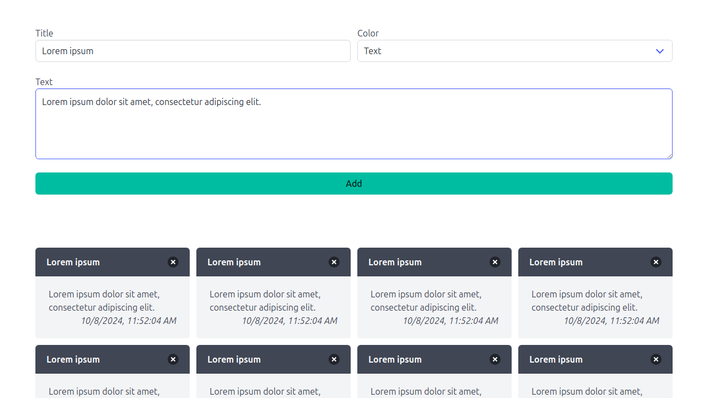

# Notebook

Create an application that would allow users to take notes and select their color from a predefined list.
Date of the note should be set to current date and time, and the notes must be arranged/grouped by color.
Use local storage to save and retrieve notes automatically.

## Requirements

- Form with the following fields:
  - title (a required `text input` with `id` *title*)
  - color (a required element with `id` *color*)
  - text (a required `textarea` with `id` *text*)
  - button (a required `button` with `id` *addNote*)
- Form controls should be wrapped inside the divs (`#fieldTitle`, `#fieldColor`, and `#fieldText`) as follows. See Bulma's documentation for details.

```html
<div id="fieldID">
  <label>...</label>
  <div class="control">
    Input element (<input>, <select>, or <textarea>)
  </div>
  <p class="help">...</p>
</div>`
```

- User input must be validated and a note must not be added if either title or text is missing.
- Notes must meet the following requirements:
  - have `class` *note*
  - contain title, text, and date
  - color, as specified by the control of the form
  - grouped by color
  - contain a button (with `class` *deleteNote*) to delete a note
- Notes must be saved to and retrieved from the local storage automatically
  - If a page is reloaded, notes must be preserved
- Use Model-View-Controller design pattern to split the application functionality

## Testing

```bash
python3 -m pytest tests/notebook/test_notebook.py
```

## Demonstration

The following design decisions were made by me, you don't have to do the same:

- Bulma's `message` element is used to present notes.
- A `select` element with Bulma's primary colors is used to paint the notes instead of a `color` element.



## References

- [Form controls | Bulma: Free, open source, and modern CSS framework based on Flexbox](https://bulma.io/documentation/form/general/)
- [Message | Bulma: Free, open source, and modern CSS framework based on Flexbox](https://bulma.io/documentation/components/message/)
- [Color Palettes in Bulma | Bulma: Free, open source, and modern CSS framework based on Flexbox](https://bulma.io/documentation/features/color-palettes/)
