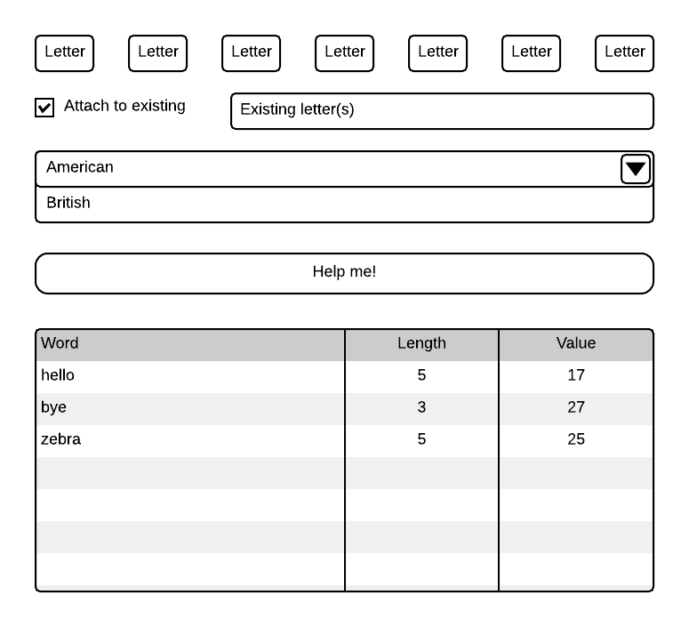
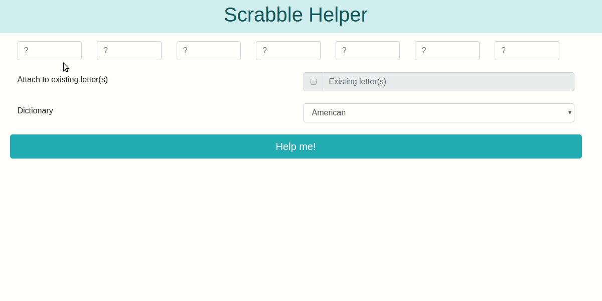

# Scrabble helper



Create a web app with the following functionality:

1. Take up to 7 letters as input and generate all possible dictionary (american/british) words from those letters

    * A user may provide fewer than 7 letters
    * Wildcard \* should be acceptable (no more than 1) but not added to the value of the word
    * **Nothing found** is a valid result

2. Words should be ordered by the total word value

    * Bonus **+10%** if you can make the table sortable by either column

3. If specified by the user, the generated words must contain the provided existing letter(s)

    * *Existing letter(s)* field should stay disabled until *Attach to existing* option is checked
    * You could try attaching your letters to *existing letter(s)* to form plural form of a word or a compound word. Remember that in Scrabble any new word must be attached to a word already on the board.
    * The letter(s) in the *Existing letter(s)* field must be treated as a single unit and not broken apart.

4. Your application must not be slow



## Dictionaries

Use the standard Ubuntu dictionaries found in `/usr/share/dict/`.

* American English

```text
/usr/share/dict/american-english
```

* British English

```text
/usr/share/dict/british-english
```

## Grading

1. Proper form elements (text fields, drop-downs, checkbox, button)
2. Generate permutations of letters
3. *Not found* is handled correctly
4. Existing letters are used properly
5. Both dictionaries are used
6. Wildcard is processed correctly
7. Word value is calculated properly (wildcard value is 0)
8. Table is generated and sorted by value
9. Everything works
10. Efficiency

## References

* [Scrabble - Wikipedia](https://en.wikipedia.org/wiki/Scrabble)
* [Scrabble letter distributions - Wikipedia](https://en.wikipedia.org/wiki/Scrabble_letter_distributions)
