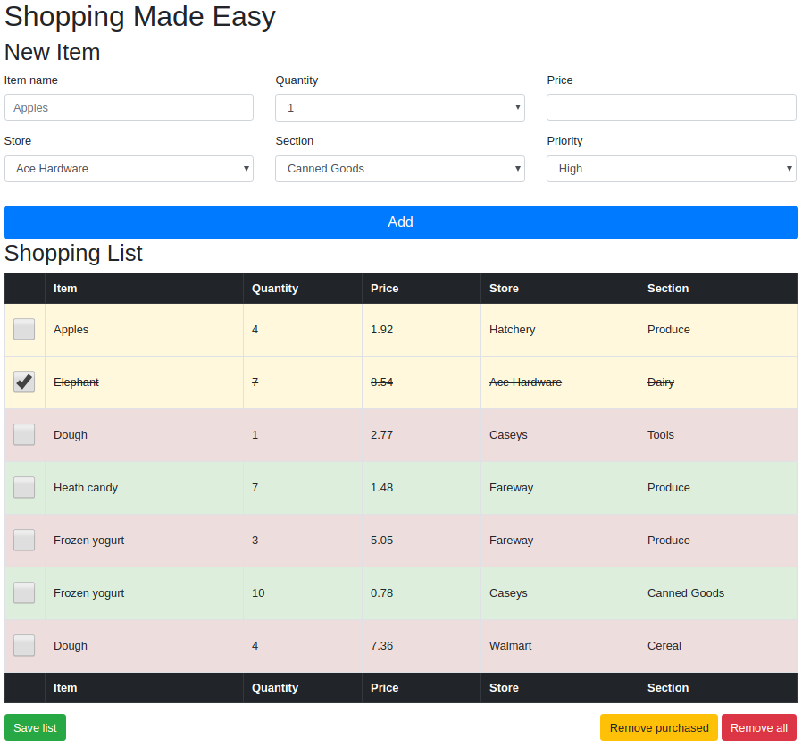

# Shopping List

Implement the following Shopping List functionality using HTML, CSS, and JavaScript. Use of Bootstrap is mandatory.

## Design

Your application may have a different design as long as you implement the required functionality.

Buttons *Add*, *Save list*, *Remove purchased*, and *Remove all* must perform the following tasks:

| Button clicked | Expected result |
|---|---|
| Add | collect values from the input fields, validate them, and create a new row in the table with those values |
| Save list | save current state of the list using *local storage*. The list should be regenerated upon page refresh |
| Remove purchased | remove *purchased* (selected) items from the list |
| Remove all | clear the list completely |

## Implementation

* Use Bootstrap to style your application
* Use model-view-controller approach
* Use local storage to save and retrieve the list

## Grading criteria

1. Use Model-View-Controller pattern
2. Load the shopping list from local storage, if present
3. Save the shopping list to local storage on button click
4. Remove all items marked as purchased from the shopping list on button click
5. Remove all items from the shopping list on button click
6. Add new item to the shopping list on button click
7. Validate input fields. Do not allow accept empty values
8. Use checkbox and an item title to mark an item as purchased
9. Consistent design using Bootstrap
10. Code is error-free
