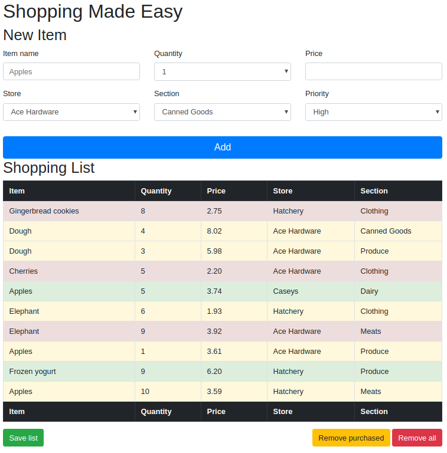

# Shopping List: Storage

Implement the following Shopping List functionality using HTML, CSS, and JavaScript.

## User interface

## Functional requirements

* When the page is loaded:

    * drop-downs *Quantity*, *Store*, *Section*, and *Priority* are automatically generated using JavaScript
    * *shopping list* is populated based on values stored in the **local storage**, if any

* When button **Add** is clicked:

    * collect values from the input fields
    * validate input values, do not accept empty fields
    * create a new row in the table with item values
    * color of the row depends on the item priority

* When button **Save list** is clicked:

    * save current state of the list using **local storage**

* When button **Remove purchased** is clicked:

    * remove purchased items from the list

* When button **Remove all** is clicked:

    * clear the list completely

* When a *checkbox* or a *row* is clicked:

    * mark the corresponding item as *purchased*

## Non-functional requirements

* Use **Model-View-Controller** architecture pattern

* Use **Observer** design pattern to connect *model* and *view*

* Use **Bootstrap** to align and add style to the elements on the page
